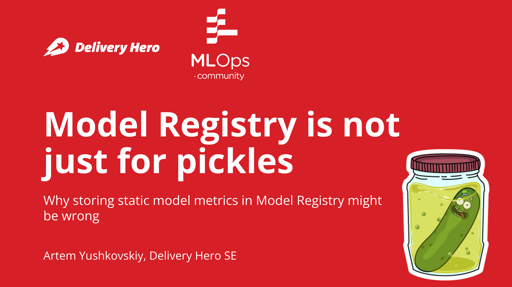

# Demo for the talk: Model Registry is not just for pickles
- 2022-10-06 - MLOps Community Berlin Meetup #2
- 2022-10-19 - MLOps guild @ Delivery Hero SE



## Description
This demo shows a sample MLOps setup for a live model with constantly drifting data (yes, we use wine dataset as an example 😅).

The main idea is that the static metrics stored in the static page of Model Registry are incomparable if the data distribution changes. So we need to have a separate model evaluation workflow that would compare the given model with the models of interest (`Staging`, `Production`) against the same dataset (latest, if possible).

To run workflow: create a PR, push to `main` or run the workflow manually:
```
gh workflow run train-model -f experiment_prefix=artem-test \
    -f alpha=0.5 \
    -f l1_ratio=0.2 \
    -f data_train_size=0.75 \
    -f seed=42
```

CI/CD workflow [`.github/workflows/train-model.yml`](.github/workflows/train-model.yml) can be run both as CI/CD and as a manual workflow. It exposes model's parameters, trains and evaluates the model, prints links to the MLflow dashboard to the GitHub Action run's `Summary`. The summary is printed using scripts from [`mlflow_toolkit/get_model_info.py`](mlflow_toolkit/mlflow_toolkit/get_model_info.py).

MLflow is hosted in DagsHub in a connected repository: https://dagshub.com/atemate/mlflow-with-gh-actions.mlflow/.
